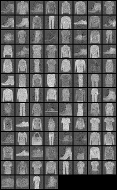
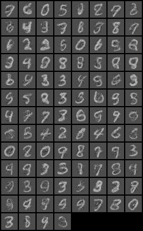

# Non Linear Independent Components Estimation (NICE)

This project implements the models proposed in [NICE: Non-linear Independent Components Estimation](https://arxiv.org/abs/1410.8516)
written by Laurent Dinh, David Krueger and Yoshua Bengio.

The model is trained separately on two datasets:
- MNIST
- MNIST Fashion

The results of the models can be found in [results.pdf](./results.pdf).




## Running the code
1. You can install the required libraries running
    ```bash
    pip install -r requirements.txt
    ```
2. Run:
    ```bash
    python3 train.py
    ```
